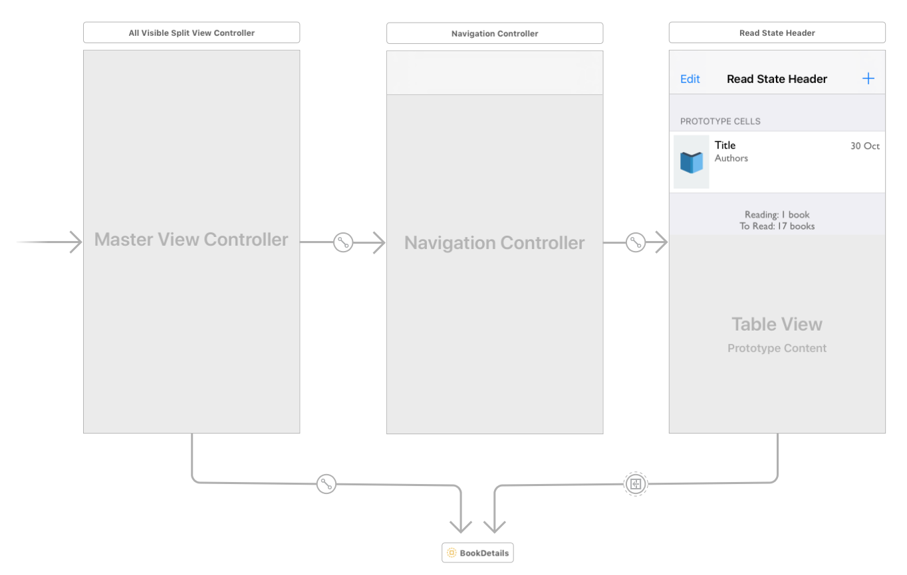
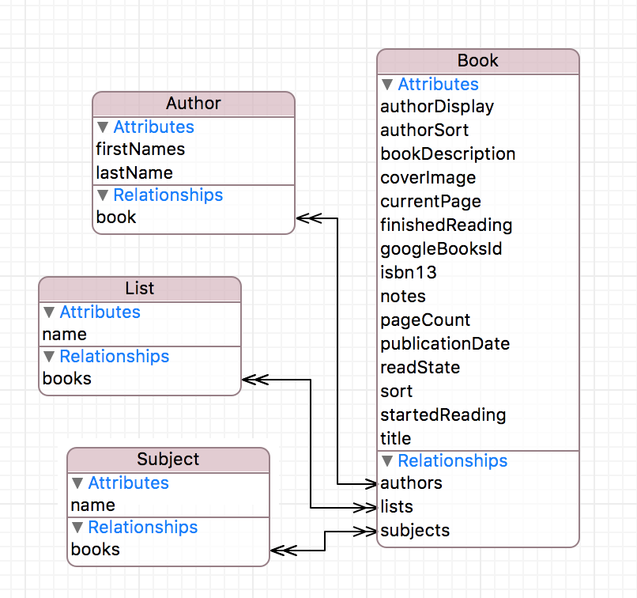

# Reading List

[Reading List](https://www.readinglist.app) is a free, open source iOS app for iPhone and iPad. Reading List allows users to track and catalog the books they read.

</img>

## Requirements
 - Xcode 10

## Dependencies

Reading List uses a couple of package managers:

- [Mint](https://github.com/yonaskolb/Mint), to manage Swift command line tool packages
- [Bundler](https://github.com/bundler/bundler), to manage Ruby tools

Mint can be installed using [Homebrew](https://brew.sh/) (among [other methods](https://github.com/yonaskolb/Mint#installing)); Bundler can be installed with [RubyGems](https://rubygems.org/):

    brew install mint
    gem install bundler

### XcodeGen
The Xcode project should be generated by running [XcodeGen](https://github.com/yonaskolb/XcodeGen):

    mint run yonaskolb/XcodeGen

### CocoaPods
Reading List uses various third party libraries, which are managed using [CocoaPods](https://cocoapods.org/). To ensure that CocoaPods is installed, run `bundler install`. To install the libraries, run:

    pod install

## Architecture
Reading List is written in Swift, and primarily uses Apple provided technologies.

### UI
Reading List mostly uses [storyboards](https://developer.apple.com/library/content/documentation/General/Conceptual/Devpedia-CocoaApp/Storyboard.html) for UI design (see below); a limited number of user input views are built using [Eureka](https://github.com/xmartlabs/Eureka) forms.

### Data persistence
Reading List uses [Core Data](https://developer.apple.com/documentation/coredata) for data persistence. There are three entities used in Reading List: `Book`, `Subject` and `List`. The attributes and relations between then are illustrated below:

